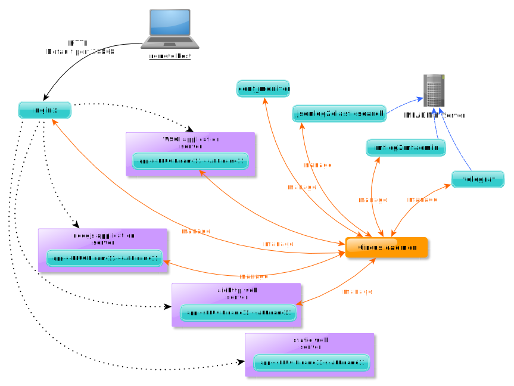

# Introduction to MFSERV

## What is mfserv?

Mfserv is the acronym of the "**M**etwork **F**ramework **SERV**ices" module. This module is a kind of private [PAAS](https://en.wikipedia.org/wiki/Platform_as_a_service) which help to develop, run and manage webservices applications.

With this module, you can easily implement robust webservices with:

- synchronous Python3 and synchronous Python2 (with a custom virtualenv including the framework you want like [Django](https://www.djangoproject.com/), [Flask](http://flask.pocoo.org/)...)
- asynchronous Python3 (with [aiohttp](https://aiohttp.readthedocs.io/) and your custom virtualenv)
- [nodejs](http://nodejs.org) (and your custom `node_modules`)

All these technologies are managed in a "production ready" with:

- a dynamically configured `nginx` webserver in front
- some multiple workers in back
- memory limits
- autorestart features
- logs and metrics

## How it works?

**MSERV relies on the following components:**

- [Circus](https://circus.readthedocs.io/en/latest/) monitors and controls processes and sockets. Circus acts as a process watcher and runner. You may check the full `circus.ini` configuration file in the `/home/mfserv/tmp/config_auto/` directory. Check the [Circus architecture](https://circus.readthedocs.io/en/latest/design/architecture/)
- [Telegraf](https://docs.influxdata.com/telegraf/) acts as a server agent for collecting and sending metrics and events from databases, systems, and IoT sensors.
- [Elasticsearch](https://www.elastic.co/products/elasticsearch) is a distributed, RESTful search and analytics engine.
- [Nginx](https://www.nginx.com/) acts as a web server container.
- [jsonlog2elasticsearch](https://github.com/metwork-framework/jsonlog2elasticsearch) is a daemon to send json logs read from a log file to elasticsearch.
- mflog2mfadmin (based jsonlog2elasticsearch) is a daemon to send [mflog](https://github.com/metwork-framework/mflog) logs to elasticsearch.
- `conf_monitor` is a Metwork tool in order to monitor the configuration files.

`step-{{PLUGIN.name}}.{{APP.name}}` is the step defines in your plugin.  There is as many `step-{{PLUGIN.name}}.{{APP.name}} ` as plugins. You may have more than one `step` in the same plugin.

If the MFSERV plugin is :ref:`configured for monitoring <mfserv_tuning_monitoring:Monitor a plugin>`, the metrics are send via [Telegraf](https://docs.influxdata.com/telegraf/) to the [InfluxDB](https://docs.influxdata.com/influxdb/) database on the MFADMIN server.

.. todo:: add information on WSGI, nodejs, aiohttp and link to the corresponding MFSERV templates.

.. seealso::
    | :doc:`MFADMIN Documentation <mfadmin:index>`
    | :doc:`mfadmin:mfadmin_monitoring_plugins`
    | :ref:`mfadmin:mfadmin_miscellaneous:Circus hooks` 

## MFSERV configuration

The configuration of the MFSERV and its components is stored in the `config/config.ini` file of the root directory of the `mfserv` user. Check this file for further information.

<!--
Intentional comment to prevent m2r from generating bad rst statements when the file ends with a block .. xxx ::
-->
